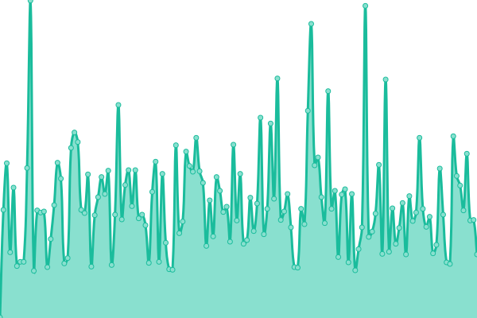

# [📈 Live Status](https://status.higg.com): <!--live status--> **🟩 All systems operational**

This repository contains the open-source uptime monitor and status page for [higgco](https://status.higg.com), powered by [Upptime](https://github.com/upptime/upptime).

With [Upptime](https://upptime.js.org), you can get your own unlimited and free uptime monitor and status page, powered entirely by a GitHub repository. We use [Issues](https://github.com/higgco/higg-status/issues) as incident reports, [Actions](https://github.com/higgco/higg-status/actions) as uptime monitors, and [Pages](https://status.higg.com) for the status page.

<!--start: status pages-->
<!-- This summary is generated by Upptime (https://github.com/upptime/upptime) -->
<!-- Do not edit this manually, your changes will be overwritten -->
<!-- prettier-ignore -->
| URL | Status | History | Response Time | Uptime |
| --- | ------ | ------- | ------------- | ------ |
|  [Portal HIGG](https://portal.higg.org) | 🟩 Up | [portal-higg.yml](https://github.com/higgco/higg-status/commits/HEAD/history/portal-higg.yml) | 

 517ms
     
 | 

<a href="https://status.higg.com/history/portal-higg">100.00%</a>
    

|  Portal HIGG Backend | 🟩 Up | [portal-higg-backend.yml](https://github.com/higgco/higg-status/commits/HEAD/history/portal-higg-backend.yml) | 

 403ms
     
 | 

<a href="https://status.higg.com/history/portal-higg-backend">100.00%</a>
    

|  [Profiles HIGG](https://profiles.higg.com) | 🟩 Up | [profiles-higg.yml](https://github.com/higgco/higg-status/commits/HEAD/history/profiles-higg.yml) | 

 198ms
     
 | 

<a href="https://status.higg.com/history/profiles-higg">100.00%</a>
    

|  [Corp Reporting](https://corpreporting.higg.com) | 🟩 Up | [corp-reporting.yml](https://github.com/higgco/higg-status/commits/HEAD/history/corp-reporting.yml) | 

 178ms
     
 | 

<a href="https://status.higg.com/history/corp-reporting">100.00%</a>
    

<!--end: status pages-->

[**Visit our status website →**](https://status.higg.com)

## 📄 License

- Powered by: [Upptime](https://github.com/upptime/upptime)
- Code: [MIT](./LICENSE) © [higgco](https://status.higg.com)
- Data in the `./history` directory: [Open Database License](https://opendatacommons.org/licenses/odbl/1-0/)
